# 🗺️ Atlas - AI Assistant for Product Professionals

> Your guide through product prioritization and backlog management

*Built for Product Owners, Product Managers, and anyone managing product backlogs*

---

## 🎯 Overview

Atlas is a conversational AI assistant designed to help **Product Owners and Product Managers** reduce time spent on repetitive operational tasks. Rather than replacing product judgment, it automates the mechanical aspects of backlog management, allowing product professionals to focus on strategic decisions.

**Built by:** [Ghiselle Butrón](https://linkedin.com/in/ghiselle-butron-reyes)  
**Timeline:** 1 week (November 2024)  
**Tech Stack:** Poe.com, Claude-Sonnet-3.5, Prompt Engineering  
**Type:** MVP concept validation / Learning project

---

## ✨ Features

### 1️⃣ User Story Generator
Transform vague feature descriptions into well-structured user stories following best practices.

**Example:**
- **Input:** "Users need to save searches"
- **Output:** "As a registered user, I want to save my favorite searches, so that I can access them quickly without searching again"

### 2️⃣ RICE Prioritizer
Objectively rank features using the RICE framework with guided inputs:
- **R**each: How many users will this impact per quarter?
- **I**mpact: How much will it impact each user? (0.25=minimal to 3=massive)
- **C**onfidence: How confident are we in our estimates? (percentage)
- **E**ffort: How much work is required? (person-months)

**Formula:** `RICE Score = (Reach × Impact × Confidence) / Effort`

### 3️⃣ Acceptance Criteria Creator
Generate clear, testable acceptance criteria for user stories using Given-When-Then format when appropriate.

### 4️⃣ Success Metrics Advisor
Get relevant KPI suggestions tailored to your feature type, with explanations of why each metric matters.

---

## 🚀 Try It

### **[→ Launch Atlas ←](https://poe.com/Atlas.PM)**

*Requires free Poe account (2 min signup)*

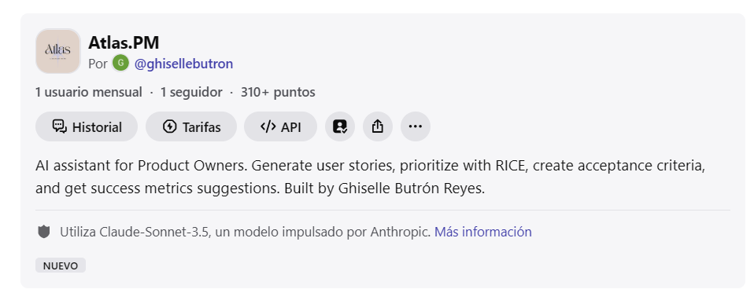

---

## 🤔 Why Not Just Use a Regular AI Chat?

**Great question.** For users skilled in prompt engineering, using Claude, ChatGPT, or any AI chat directly can achieve similar results. 

Atlas isn't about revolutionary technology—it's about **product design and accessibility**.

### Where Atlas Adds Value

**1. Reduced Friction**
- No need to craft prompts from scratch each time
- Pre-optimized prompts tested across 15+ real scenarios
- Consistent structure and format
- No "blank page syndrome"

**2. Democratized Access**
- Not everyone managing product is a prompt engineering expert
- Makes AI capabilities discoverable through clear options
- Guides users through the process step-by-step
- Works the same way every time, regardless of AI experience

**3. Standardization**
- Teams get consistent user story formats
- RICE calculations follow the same methodology
- Reduces variability in output quality—critical when multiple PMs/POs are writing stories
- Everyone uses the same framework

**4. Focused Experience**
- Purpose-built for product management tasks vs general-purpose chat
- Relevant examples and guidance built-in
- Less cognitive load to get started
- No distractions from unrelated capabilities

**Think of it as:** 

General AI chats (Claude, ChatGPT, Gemini) are like having a full kitchen with every tool and ingredient imaginable. 

Atlas is an optimized recipe card for specific dishes you cook regularly—you still use the same ingredients, but the instructions are pre-written, tested, and ready to follow.

### What Makes Atlas Different from Opening Claude/ChatGPT?

| Aspect | General AI Chat | Atlas |
|--------|-----------------|-------|
| **Getting Started** | Blank prompt - what do I ask? | 4 clear options to choose from |
| **Prompt Quality** | Depends on your skill | Pre-optimized through 15+ tests |
| **Consistency** | Varies by how you ask | Same structure every time |
| **Learning Curve** | Need prompt engineering skills | Guided experience for everyone |
| **Context** | General purpose assistant | Purpose-built for PM tasks |

---

## 🛠 How I Built It

### Development Process

1. **Research** (2 hours)
   - Interviewed 3 Product Owners about repetitive tasks
   - Identified pain points: user story writing, prioritization, criteria definition

2. **Design** (3 hours)
   - Mapped workflows for each task
   - Defined 4 core functionalities based on frequency and impact
   - Prioritized using RICE (meta!)

3. **Prompt Engineering** (5 hours)
   - Crafted structured prompts for each feature
   - Iteratively refined based on output quality
   - Tested edge cases and ambiguous inputs

4. **Model Selection** (1 hour)
   - Compared GPT-4o-Mini vs Claude-Sonnet-3.5
   - Evaluated on: consistency, formatting, instruction-following
   - **Result:** Claude superior for structured PM outputs

5. **Testing** (3 hours)
   - Validated with 15+ real-world scenarios
   - Adjusted prompts based on failure modes
   - Optimized for clarity and consistency
     
6. **Documentation** (2 hours)
   - Wrote comprehensive README with project overview, learnings, and roadmap
   - Captured screenshots demonstrating the 4 core features
   - Documented development process and technical decisions
     
### Tech Stack

- **Platform:** Poe.com (no-code conversational AI builder) was a strategic choice for this MVP phase, prioritizing speed and learning over infrastructure complexity.
   - **Why on Poe:**
     - Rapid prototyping: No-code platform enabled idea-to-prototype in days instead of weeks
     - Focus on core value: Time spent on UX and prompt optimization, not API management or hosting setup
     - Model flexibility:** Native support for testing multiple AI models (Claude, GPT-4) without separate API integrations
     - Lean validation:** Perfect for testing the core hypothesis—"Is an AI assistant for PM tasks genuinely useful?"—before investing in custom de
- **AI Model:** Claude-Sonnet-3.5 (Anthropic)
  - **Why Claude over GPT:**
    - Superior instruction-following for structured outputs
    - More consistent formatting (critical for user stories and criteria)
    - Better at maintaining conversation context within session
    - Natural, professional tone matching PM communication style
    - Lower hallucination rate in factual content
  - **Tradeoff:** Slightly slower response time vs GPT-4o-Mini, but quality justifies it
- **Core Technique:** Advanced prompt engineering with structured outputs
- **Design Approach:** Conversational UX principles

**Model Selection Rationale:**

After testing both GPT-4o-Mini and Claude-Sonnet-3.5 with identical prompts, Claude consistently produced:
- Better-formatted user stories (cleaner structure)
- More reliable RICE calculations (fewer math errors)
- More professional tone in outputs
- Better adherence to Given-When-Then format in acceptance criteria

For a tool where **consistency and precision matter**, Claude was the clear choice.

### Philosophy

**Product thinking over technical complexity.** The goal wasn't to write code, but to design a user experience that solves real problems through the right tool selection and thoughtful prompt design.

---

## 📚 Key Learnings

### Technical Insights

💡 **Prompt structure is 90% of output quality**  
The way you frame requests, provide context, and structure expected outputs matters far more than raw model capability.

💡 **Model selection is a product decision**  
Choosing Claude over GPT wasn't about "better AI"—it was about fit for purpose. Claude's strengths (structured outputs, consistency) aligned perfectly with PM tasks. This is product thinking applied to tech choices.

💡 **Real scenarios ≠ theoretical scenarios**  
Edge cases and ambiguous inputs only emerge through actual testing. What works in theory often fails in practice.

💡 **Examples dramatically improve consistency**  
Including concrete examples in prompts (few-shot learning) creates more predictable and useful outputs across both models.

### Product Insights

💡 **Conversational UX is product design**  
How the bot asks clarifying questions, guides users, and structures information is as important as the quality of final outputs.

💡 **Constraints drive prioritization**  
Platform limitations (like Poe's usage caps) forced me to focus on the highest-impact features first—a valuable PM exercise.

💡 **Accessibility matters more than sophistication**  
A simple tool that anyone can use beats a powerful tool that requires expertise.

### Meta-Learning

💡 **Shipping beats perfecting**  
Better to have a functional MVP with documented limitations than an unfinished "perfect" solution.

💡 **Product value ≠ technical complexity**  
The most valuable products often solve problems through design and UX, not advanced technology.

---

## 📊 Hypothetical Impact

If this were deployed as a production tool, I would measure success through:

| Metric | Target | Why It Matters |
|--------|--------|----------------|
| **Time saved per task** | 60% reduction | Validates core value proposition |
| **Adoption rate** | 70% of POs using weekly | Indicates product-market fit |
| **Output quality score** | 4.5+ / 5.0 | Ensures generated content is actually useful |
| **Weekly return rate** | 80% active users | Measures stickiness and real value |
| **Tasks completed** | 500+/week | Shows sustained usage and utility |

### Success Criteria for V1

- ✅ Generates structurally correct user stories 95% of the time
- ✅ RICE calculations are mathematically accurate 100% of the time
- ✅ Acceptance criteria are testable and specific
- ✅ Users can complete tasks 3x faster than manual approach

---

## 🗺 Roadmap v2.0

If this were to evolve into a production product, next iterations would include:

### Integration Layer
- [ ] **Jira/Linear sync** - Direct backlog import and export
- [ ] **Slack/Teams integration** - Access Atlas from where teams work
- [ ] **GitHub integration** - Link stories to code

### Intelligence Layer
- [ ] **Project memory** - Maintain context across sessions
- [ ] **Team learning** - Adapt to company-specific terminology
- [ ] **Historical analysis** - Learn from past prioritization decisions

### Collaboration Layer
- [ ] **Multi-user sessions** - Collaborative prioritization workshops
- [ ] **Template library** - Share best practices across teams
- [ ] **Commenting & feedback** - Iterate on generated content

### Customization Layer
- [ ] **Configurable frameworks** - Beyond RICE (Kano, etc.)
- [ ] **Multi-language support** - Spanish, English, others

### Analytics Layer
- [ ] **Usage patterns** - Understand bottlenecks
- [ ] **Quality metrics** - Track output effectiveness

---

## ⚠️ Current Limitations

### Platform Constraints
- **Usage limits:** Poe free tier operates on a daily points system - users receive points that reset every 24 hours, allowing approximately 10-15 conversations per day depending on conversation length
- **No persistence:** Does not remember past conversations or projects
- **No integration:** Works standalone, doesn't sync with PM tools

### Functional Constraints
- **No project context:** Doesn't know your product, users, or constraints
- **Requires validation:** All outputs need human review and refinement
- **Generic advice:** Can't access your specific data or metrics

### Production Approach

For a real deployment, I would:
1. Use Anthropic API directly (eliminates platform limits)
2. Build database layer for project context and history
3. Implement auth and team management
4. Create integration layer for Jira, Slack
5. Add feedback mechanisms to improve over time

**This MVP proves the concept. Production would require a couple months of development.**

---

## 🎯 What This Project Demonstrates

### Product Management Skills

✅ **Problem Identification**  
Recognized that POs spend 30-40% of time on operational tasks that could be streamlined

✅ **Solution Design**  
Designed focused solution addressing 4 high-impact use cases vs trying to solve everything

✅ **Prioritization**  
Applied RICE framework to features themselves—chose quick wins over nice-to-haves

✅ **User-Centric Thinking**  
Optimized for accessibility (non-experts) over sophistication (power users)

✅ **Iterative Development**  
Rapid MVP → test → refine cycle over 1 week

### Technical Understanding

✅ **AI Application Knowledge**  
Understands where AI adds value and where it doesn't

✅ **Prompt Engineering**  
Practical experience crafting effective prompts for consistent outputs

✅ **Model Selection**  
Made informed technical decisions based on use case requirements, not hype

✅ **Limitations Awareness**  
Clear-eyed about what this is (design project) vs what it isn't (technical innovation)

### Execution

✅ **Rapid Prototyping**  
Idea to functional demo in 1 week

✅ **Professional Documentation**  
Case study, README, clear communication

✅ **Honest Communication**  
Transparent about limitations and tradeoffs

---

## 📸 Screenshots

### Example Case: E-commerce "Save for Later" Feature

The following screenshots demonstrate Atlas's capabilities using a single, end-to-end product scenario: designing a "Save for Later" feature for an e-commerce mobile app. This flow shows how Atlas supports the complete product development process from initial concept to success measurement.

### Atlas Interface
*Atlas greets you with clear options for the 4 main features*
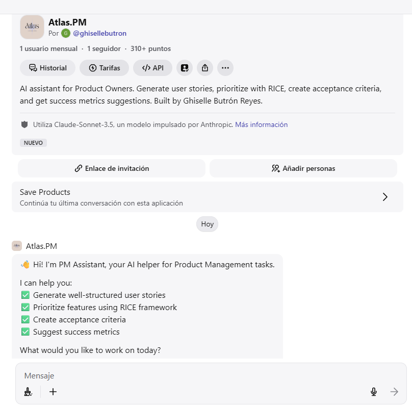

---

### 1. User Story Generation
*Input: "Users need to save searches" 
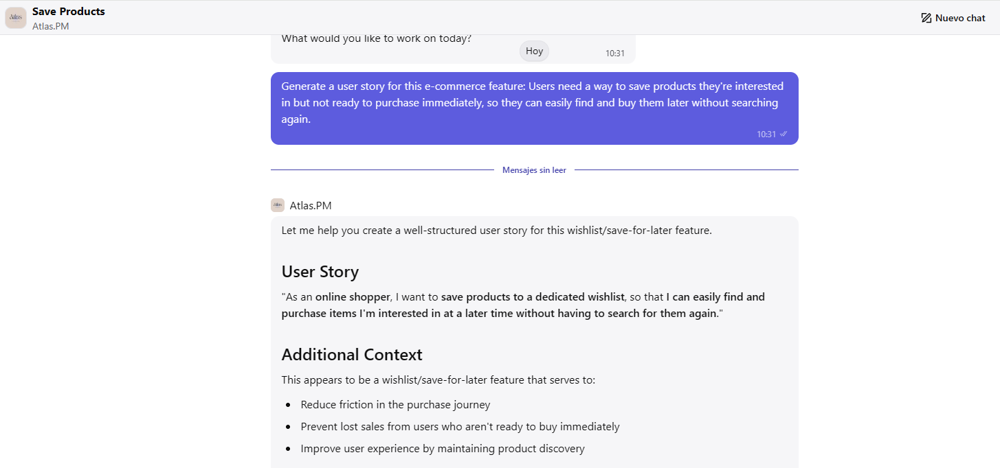

*→ Output: Well-structured user story following best practices*
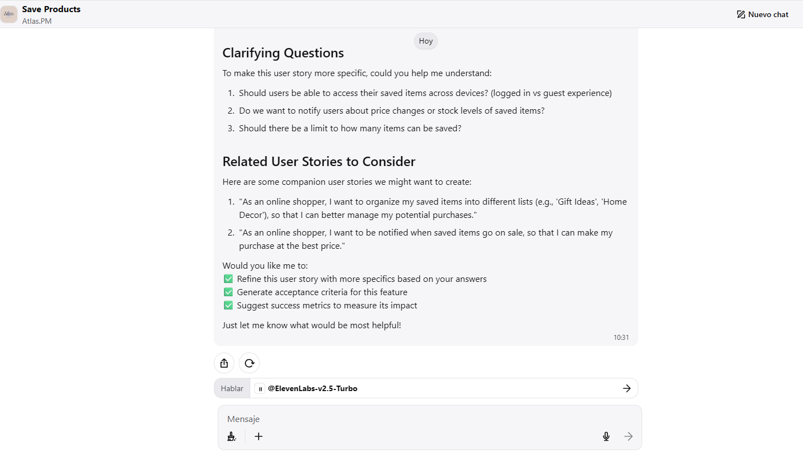

---

### 2. RICE Prioritization
*Guided input collection → Calculated RICE scores → Ranked recommendations with explanations*
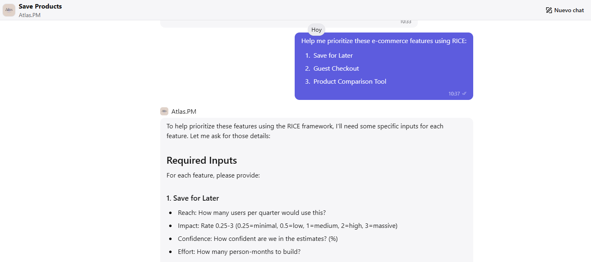

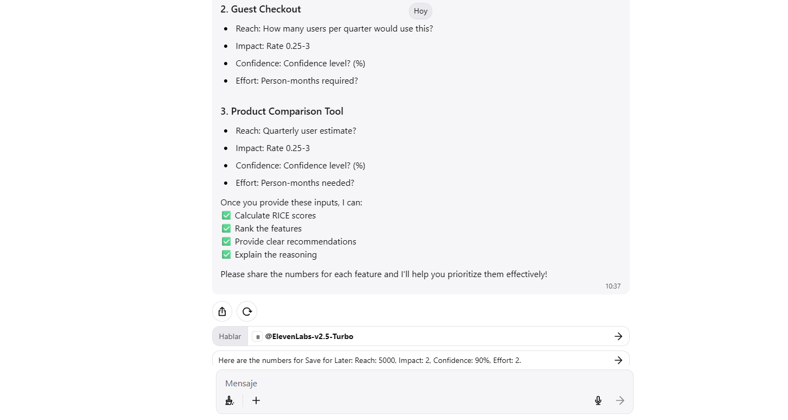

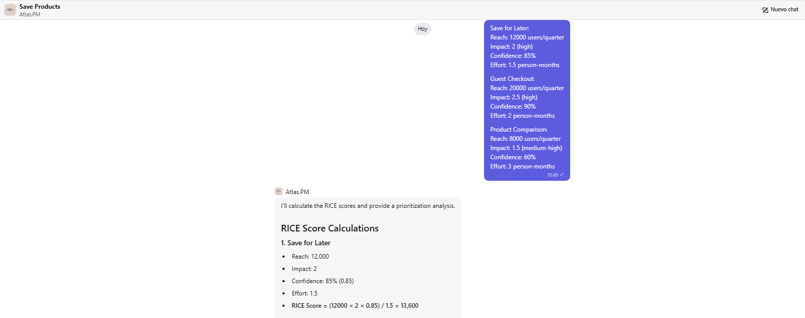

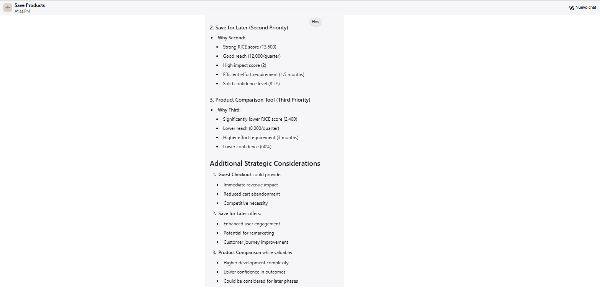

---

### 3. Acceptance Criteria
*User story input → Clear, testable acceptance criteria using Given-When-Then format*
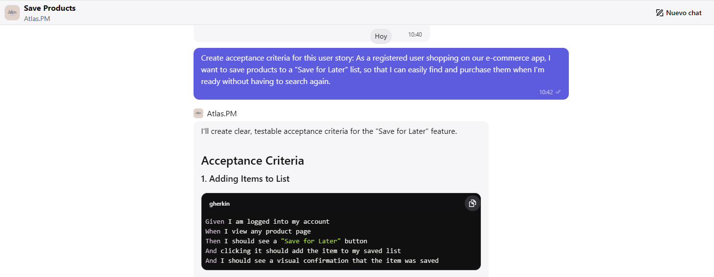

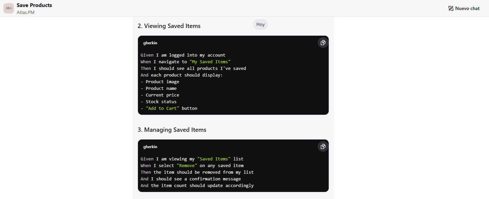

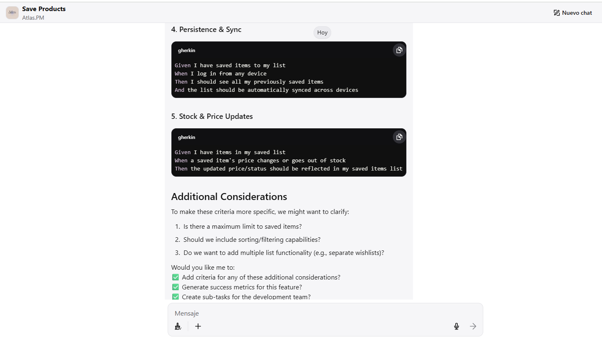

---

### 4. Success Metrics
*Feature description → Relevant KPIs with explanations of why each metric matters*
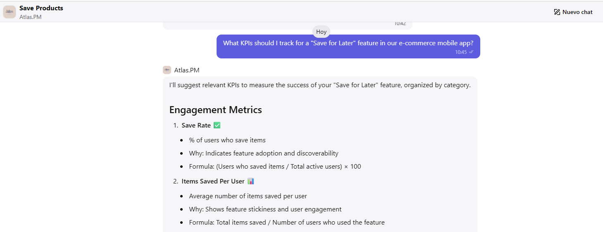

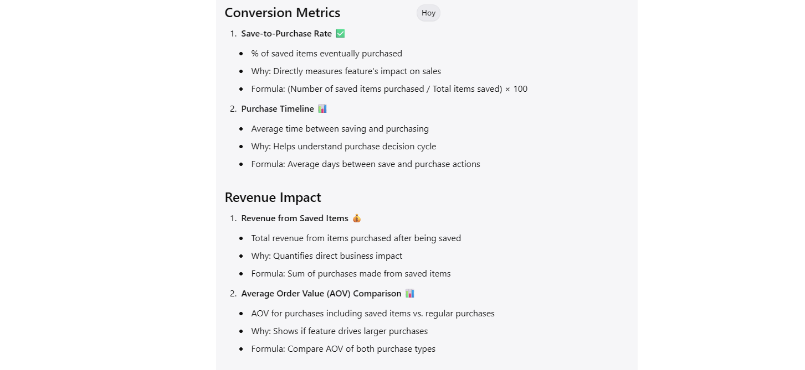

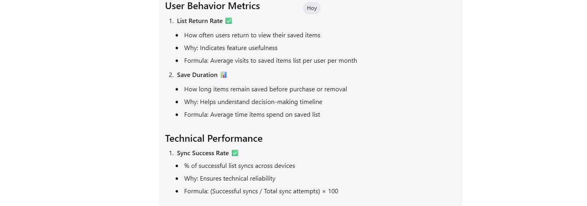

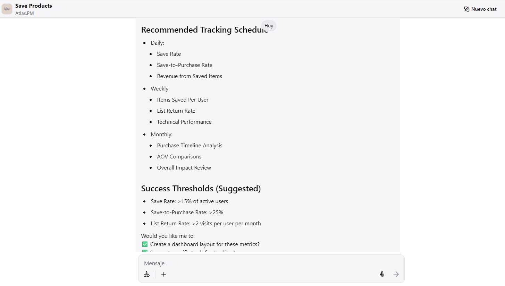

---

### ⚠️ Important Note on Data Privacy

**Do not input confidential or proprietary company information into Atlas (or any public AI tool).**

While Atlas is designed to help with product management tasks, it operates through Poe.com using third-party AI models (Claude). Any information you input:
- May be used to train AI models
- Is processed by external services
- Should not include sensitive business data, unreleased product details, or confidential metrics

**Best practices:**
- ✅ Use hypothetical scenarios and generic examples
- ✅ Anonymize any company-specific information
- ✅ Work with placeholder data for testing
- ❌ Never input actual company OKRs, roadmaps, or proprietary metrics
- ❌ Avoid real customer data or competitive intelligence

For production use with sensitive data, a custom implementation using direct API access with proper data governance would be required.

---

## 👤 About the Creator

**Ghiselle Butrón Reyes** | Product Manager

5+ years of experience in digital product management, specializing in data-driven decision-making and cross-functional team coordination. Track record of delivering measurable results for companies like CaixaBank, Škoda, and SEAT/CUPRA.

**Core Competencies:**
- 📊 Data-driven product strategy
- 🤖 AI integration in product
- 🤝 Stakeholder management
- 🔄 Agile/Scrum methodologies  

**Professional Highlights:**
- Increased lead generation by 12-30% through product optimization
- Reduced reporting time by 40% via dashboard automation
- Recent: GenAI for Product Owners certification (IBM)

**Let's Connect:**
- 📧 Email: [ghiselle.b@gmail.com](mailto:ghiselle.b@gmail.com)
- 💼 LinkedIn: [ghiselle-butron-reyes](https://linkedin.com/in/ghiselle-butron-reyes)
- 💻 GitHub: [GhiselleBR](https://github.com/GhiselleBR)

---

## 💭 Final Thoughts

Atlas isn't revolutionary technology—it's a design exercise in making AI accessible and practical for everyday PM work. 

The real innovation isn't in the code, but in recognizing that most POs don't need another powerful tool they don't know how to use. They need focused solutions that reduce friction and let them do their jobs better.

**This project demonstrates product thinking: identifying real problems, designing simple solutions, shipping quickly, and choosing the right tools for the job.**

---

**Built with ❤️ in Barcelona | November 2025**

